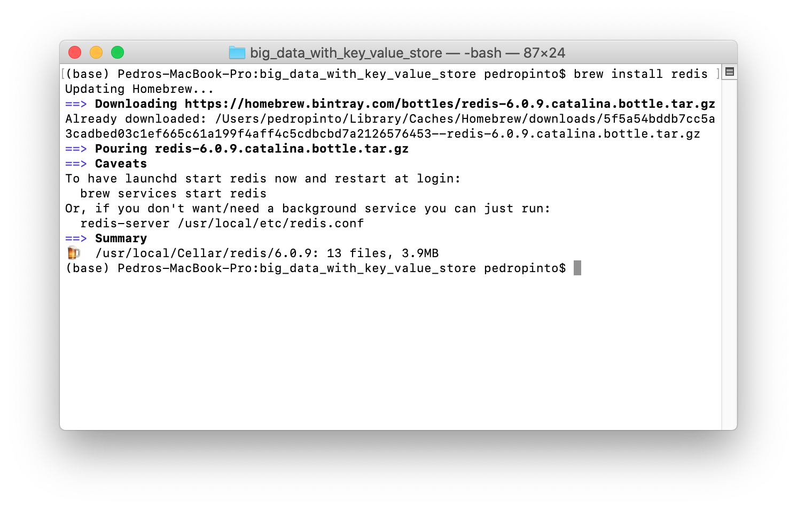
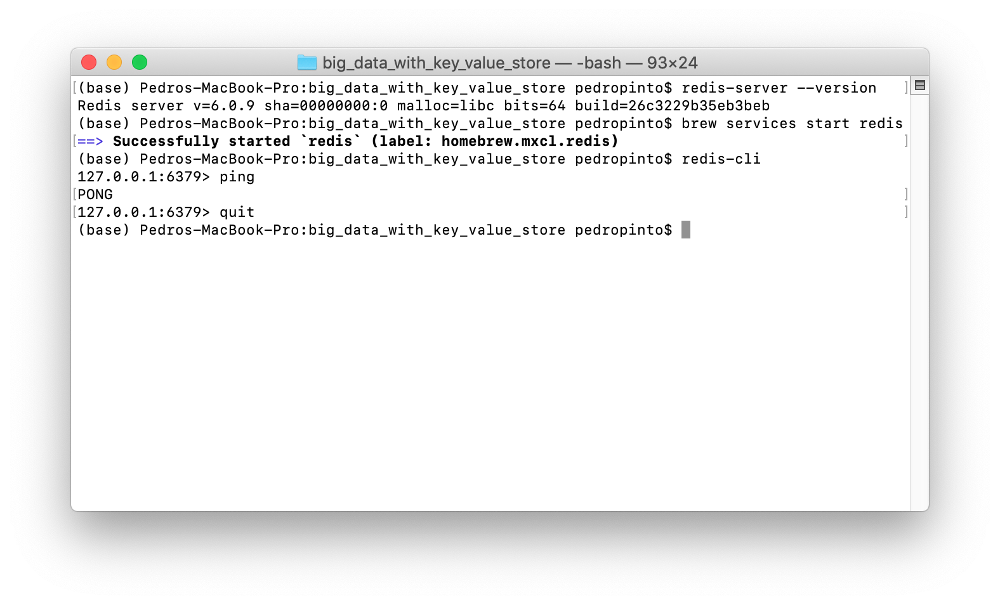
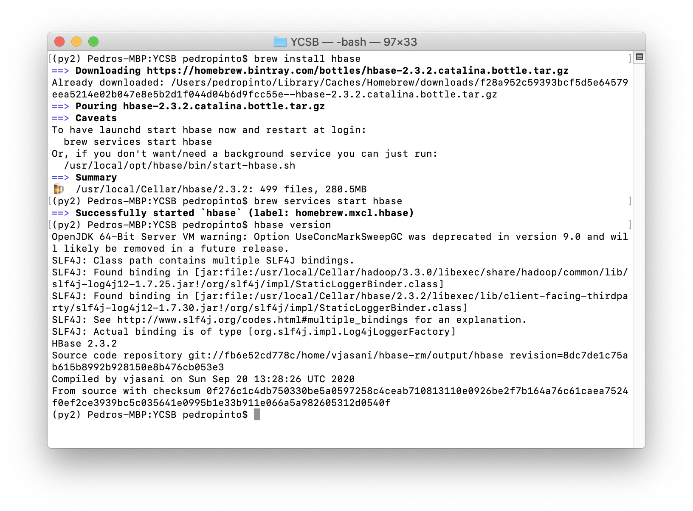
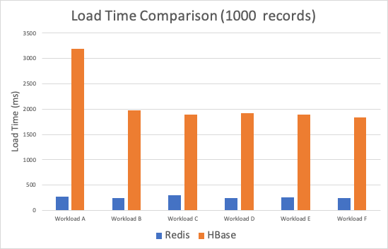
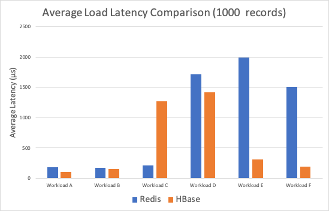
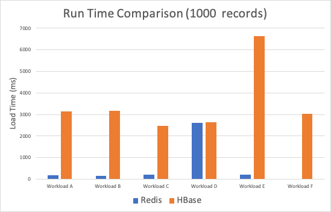

# Big Data with Key-Value Store Systems
Homework 4 for CS 6220 Big Data Systems &amp; Analytics. Problem 1. Hand-on Experience with a Key-Value Store System

# Introduction


#### Requirements:
Installed software required to run the programs in this repository:
- Java 14.0.2
- JDK 14.0.2
- Python 2.7.18
- Redis 6.0.9
- HBase 2.3.2
- Git 2.28.0 (optional)

#### My system description:
Specifications of the machine I used to run the programs in this repository:
- macOS Catalina (10.15.6)
- 2 GHz Quad-Core Intel Core i5 (10th Generation)
- 16 GB RAM
- 500 GB SSD

#### Repository Folder Structure:
- **output:** 
    - Outputs of the benchmarking results.
- **executable_scripts:** 
    - Executable shell scripts to run the benchmarking tests.
- **images:** 
    - Contains all images used in the Readme file.

# Problem 1.2  Performance Comparison of two Key-Value Systems

### For this problem, I will be comparing the popular in-memory key–value database Redis with the wide-column key-value data store HBase. 

### I. Redis

<div style="text-align:center"></div>

Originally developed by Salvatore Sanfilippo, Redis is currently the most widely used Key-Value store system in the world according to [db-engines.com](https://db-engines.com/en/ranking). It was implemented in C and thoroughly optimized to provide high speed and low latency making it a great candidate for used as a cache, message broker or even general-purpose database.

### II. Apache HBase

<div style="text-align:center"></div>

Apache HBase is an open-source project that is currently the second most widely used wide-column system in the world according to [db-engines.com](https://db-engines.com/en/ranking). It was implemented in Java and originally modeled after Google's Bigtable project. HBase significantly outperforms traditional relational databases when performing analytics in extremely large datasets.

### 1. Installation

The following installation steps are meant a machine running MacOS. If your machine is following a different operating system, please refer to the official Redis documentation at https://redis.io/topics/quickstart.

- **Install Homebrew**:

Homebrew is a Package Manager for MacOS (or linux) that makes it easier to install programs and packages. To install it, open the terminal and run the following command:

```shell
    /bin/bash -c "$(curl -fsSL https://raw.githubusercontent.com/Homebrew/install/master/install.sh)" 
```

- **Install Redis**:

After installing Homebrew, simply run the following command in the terminal to install Redis:

```shell
    brew install redis
```

You should see the following messages on your terminal:

<div style="text-align:center"></div>

- **Test Redis**:

Check which Redis version was installed (should be the most updated version):

```shell
    redis-server --version
```

Start the Redis service. By default, redis runs on port 6379, but this could be changed in the redis configuration file redis.conf located at /usr/local/etc/:

```shell
    brew services start redis
```
    Start the redis-cli and test the connection:

```shell
    redis-cli
    ping
```

If you recieve a response saying "PONG", you properly installed Redis in your machine. You can quit from the cli by running:

```shell
    quit
```

<div style="text-align:center"></div>

- **Install HBase**:

```shell
    brew install hbase
```

You should see the following messages on your terminal:

<div style="text-align:center"></div>

- **Test HBase**:

Check which Redis version was installed (should be the most updated version):

```shell
    brew services start hbase
    hbase version
```
You should see the following messages on your terminal:

<div style="text-align:center"></div>


### 2. Performance Benchmarking

To Benchmark the performance of both store systems, I used the Yahoo! Cloud Serving Benchmark found add https://github.com/brianfrankcooper/YCSB

#### Installing YCSB:

To install YCSB, make sure you have Java (https://www.java.com/en/download/) and Maven (https://maven.apache.org/install.html) installed in your machine.

Open a shell and run the following commands: 

```shell
    git clone https://github.com/brianfrankcooper/YCSB.git
    cd YCSB
    mvn -pl site.ycsb:redis-binding -am clean package
    mvn -pl site.ycsb:hbase1-binding -am clean package
```

### Running Workload Tests:

YCSB provides a number of different workloads to test the performance of different data systems:

Workloads:     
A — Update heavy: Read: 50%, Update: 50% 
B — Read heavy: Read: 95%, Update: 5%  
C — Read only: Read: 100%             
D — Read latest: Read: 95%, Insert: 5%  
E — Short range: Scan: 95%, Insert: 5%  
F — Read-modify-write: Read: 50%, Read-modify-write: 50% 

To run the workload tests, you need to start Redis and HBase, copy the executable files inside the executable_scripts folder to the home folder of YCSB and run the following commands:

```shell
    sh ./redis_benchmark.sh
    sh ./hbase_benchmark.sh
```

### 3. Performance Benchmarking Results

All the benchmark result files are located in the outputs folder

<div style="text-align:center"></div>
<div style="text-align:center"></div>
<div style="text-align:center"></div>
<div style="text-align:center"></div>

As can be seen, Redis significantly outperforms HBase in terms of run time, both for loading and running the jobs. As for the average latency, we got mixed results, with HBase outperforming Redis in some of the load tests. This results should be expected since Redis is a simpler key-value system extremely optimized for speed. The tradeoff for speed is that HBase is more versatile and has more use cases since it is a wide column database. 

